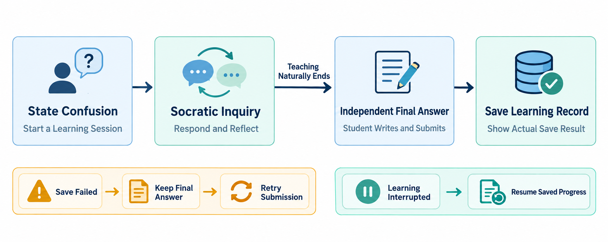
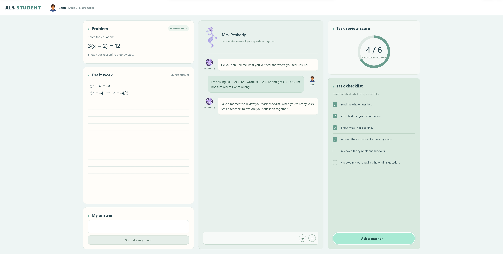
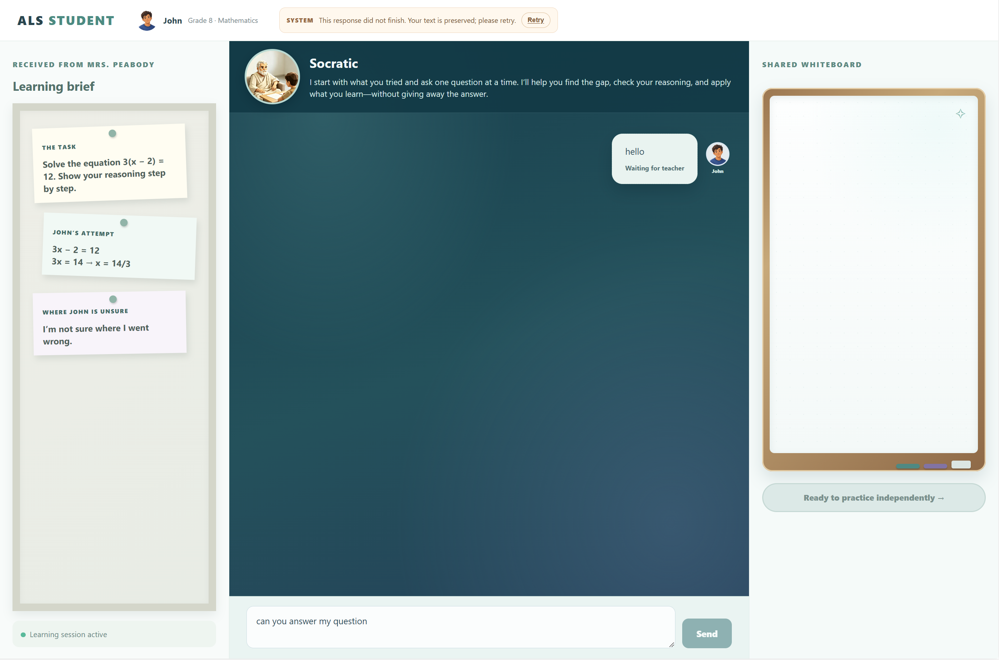

# ALS — Adaptive Learning System

[中文版](README.zh-CN.md)

I’m **Carol**, an independent researcher and technology practitioner working on adaptive learning research and product development since 2015. I believe that students who are willing to learn can find a learning path that suits them. What they often lack is not diligence, but someone who understands their current difficulties and helps them move past the points where they get stuck. With this belief, I launched and have continued to develop the three-year **AINE (A Structural Exploration of AI-Native Educational Architectures)** AI-native project since 2025.

ALS is an **LLM-based adaptive learning system** being continuously developed within AINE. Its central feature is preserving students’ ownership of their thinking: the system provides a personalized support framework that helps students continue reasoning and exploring when they get stuck.

## About AINE and ALS

ALS is part of **AINE — A Structural Exploration of AI-Native Educational Architectures**. AINE is a research and engineering initiative spanning 2025–2027. ALS builds on the Context subproject’s exploration of educational interaction, organizing teaching methods into reusable Skills and gradually combining them into an evolving learning system. Educational research and design documents are available in the [AINE OSF project archive](https://osf.io/eqv9f/overview?view_only=4d11a0a6f7264935aea08654defcce46), where readers can explore the research in more detail.

I continue to develop this project across its research questions, educational experiment design, product design, and code implementation. My [personal website](https://aine.chaohuihsu.workers.dev/) brings together my background, research outcomes, and AINE project records.

By sharing this work, I hope to provide educators, researchers, and developers with a starting point they can try, discuss, and build on, and encourage more people to create AI educational tools that address real educational problems. Please use GitHub Discussions to share development ideas, teaching scenarios, and experiences with the system. Bug reports are welcome through Issues.

## The student question experience

This repository is the runnable main project for the ongoing development of ALS. The current version focuses on helping students enter a specific learning situation from the homepage and then talk in real time with Socratic, a teacher guided by Socratic inquiry. The homepage uses one of John’s mathematics problems as a prepared example, presenting the problem, his draft solution, and a task-review checklist. Selecting **Ask a teacher** lets students discuss the problem, John’s existing attempt, and his difficulties with Socratic.

The Mrs. Peabody conversation, task-review score, checklist, and answer area on the homepage establish the learning situation before entering Socratic. This release focuses on the Socratic conversation experience, so those homepage elements are presented as a static page. Live interaction takes place in the Socratic Skill after selecting **Ask a teacher**.

- **Enter the assignment situation:** read the prepared problem, draft solution, and task-review checklist to understand the difficulty John encountered.
- **Discuss the reasoning:** respond to Socratic’s focused questions in your own words.
- **Continue thinking:** follow Socratic’s questions to organize your ideas further.
- **Move toward independent practice:** **Ready to practice independently** expresses the intended next stage of the learning flow. After working through the current question, students can leave AI support to try solving the problem independently or review their thinking further.
- **Keep a record of thinking:** conversations are saved locally so students can return to their reasoning process.

### Learning flow

The diagram presents the overall learning flow, from expressing a difficulty and discussing the reasoning to independent answers and saved learning records. The current student interface focuses on the Socratic conversation.



### Student workspace (selected screenshots)

Assignment situation



Conversation with Socratic




## Run ALS locally

### Prerequisites

- Windows, PowerShell, **Python 3.12**, and a browser.
- Download or clone this repository.
- Your own API key and model ID from a provider supporting the **Responses API**. Model usage is billed by the selected provider.

This repository includes the Socratic Inquiry Skill 2.0 files required to run the student interface. At startup, the application checks local settings, the Skill version, and required files.

```text
ALS/
├── app/
├── config/
├── skills/
│   └── socratic-inquiry/
│       ├── SKILL.md
│       └── references/
│           ├── teaching-flow.md
│           └── visibility.md
└── requirements.lock.txt
```

### 1. Install dependencies

Download or clone the source code, then open PowerShell in the ALS repository folder:

```powershell
python -m venv .venv
.\.venv\Scripts\python.exe -m pip install -r requirements.lock.txt
```

### 2. Choose your model service

Set the following values in the same PowerShell window, replacing the examples with the API key and model ID supplied by your provider:

```powershell
$env:ALS_API_KEY = '<your API key>'
$env:ALS_MODEL = '<your model ID>'
```

For OpenAI, use the default endpoint:

```powershell
$env:ALS_BASE_URL = ''
```

For another provider compatible with the Responses API, specify its endpoint. For example, the DeepSeek endpoint is:

```powershell
$env:ALS_BASE_URL = 'https://api.deepseek.com'
```

Keep your API key in your personal local environment. Each person running ALS configures their own provider credentials.

### 3. Start the application

```powershell
.\.venv\Scripts\python.exe scripts/check_config.py
.\.venv\Scripts\python.exe -m app.main
```

After the configuration check passes and the service starts, open **http://127.0.0.1:8767/** in your browser. Keep the PowerShell window open while using ALS. Select **Ask a teacher**, wait for Socratic’s opening message, then enter your reply and select **Send**.

The configuration check verifies local settings and required files. The first conversation request connects to your selected model provider. If a request fails, follow the on-screen guidance to check your API key, model permissions, account balance, and network connection. When **Retry** is available, you can try again.

Session records are saved in `var/data/sessions/`. Keep this directory as personal local data. To change the port or data location, copy `config/settings.example.toml` to `config/settings.local.toml` and update the relevant settings.

## Development and versions

This release includes **Student Interface 1.0** and **Socratic Inquiry Skill 2.0**. The corresponding Design Docs or Release Logs are available for [Student Interface 1.0](https://osf.io/eqv9f/files/swhva) and [Socratic Inquiry Skill 2.0](https://osf.io/eqv9f/files/27pz8).

To explore the complete ALS design concept and examples of the envisioned product, visit the [ALS Demo repository](https://github.com/carolhsu113/Adaptive_Learning_System_Demo).

For the full AINE research background, visit the [AINE project website](https://aine.chaohuihsu.workers.dev/).
