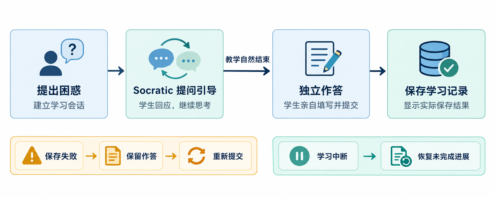

# ALS — 自适应学习系统

[English](README.md) 

我是 **Carol**，一名独立研究者与技术实践者，自 2015 年起从事自适应学习研究与产品研发。我相信，只要学生愿意学，就会有机会找到适合自己的学习路径；他们缺少的往往不是不够勤奋，而是一个能理解当下困难、陪他们跨过卡点的辅助者。基于这一信念，我在 2025 年发起并持续推进三年期的 **AINE（A Structural Exploration of AI-Native Educational Architectures）** AI 原生项目。

ALS 自适应学习系统是 AINE 中正在持续构建的 **基于 LLM 的自适应学习系统**。它的核心特色是让学生保持思考的主体性：基于大模型的自适应系统提供个性化的支持框架，帮助学生在卡住时继续推理和探索。

## 关于 AINE 与 ALS

ALS 是 **AINE「AI 原生教育结构体系的探索与实践研究」**的一部分。AINE 是一项覆盖 2025–2027 年的研究与工程计划。ALS 延续 Context 子项目对教育交互的探索，将教学方法整理为可复用的 Skill，并逐步组合成持续演进的学习系统。项目的教育研究与设计文件收录于 [AINE OSF 项目档案](https://osf.io/eqv9f/overview?view_only=4d11a0a6f7264935aea08654defcce46)，读者可通过该链接更进一步了解研究的内容。

这个项目从研究问题、教育实验设计、产品形态到代码实现，都由我持续推进。我的[个人网站](https://aine.chaohuihsu.workers.dev/)汇集了个人背景、研究成果和 AINE 项目记录。

我希望通过分享这些工作，为教育工作者、研究者和开发者提供可以体验、讨论和继续构建的起点，也鼓励更多人创造能够解决真实教育问题的 AI 教育工具。欢迎在 GitHub Discussions 交流开发想法、教学场景和使用体验；若发现 Bug，也欢迎通过 Issues 提交。

## 学生提问体验

这个仓库是 ALS 持续迭代的可运行主工程。当前版本的重点，是让学生先从首页进入一个具体的学习情境，再与基于苏格拉底式探究的 Socratic 老师实时对话。首页以 John 的一道数学题为预设案例，呈现题目、他的解题草稿和审题清单。点击 **Ask a teacher（向老师求助）** 后，学生即可围绕这道题、John 的已有尝试和困惑，与 Socratic 交流。

首页中的 Mrs. Peabody 对话、审题评分、清单和作答区域用于呈现进入 Socratic 前的学习情境。当前发布重点是 Socratic 对话体验，因此这些首页元素以静态页面展示；真实互动发生在点击 **Ask a teacher** 后进入的 Socratic Skill 中。

- **进入作业情境：**阅读首页预设的题目、草稿和审题清单，了解 John 遇到的问题。

- **讨论推理：**用自己的话回应 Socratic 提出的聚焦问题。

- **延续思考：**沿着 Socratic 的追问继续整理自己的想法。

- **进入独立作答：**页面中的 **Ready to practice independently（进入独立作答）** 用来表达后续学习流程的设计意图：当学生整理完当前问题后，可以离开 AI 支持，尝试独立完成解题，或进一步回顾自己的思考过程。

- **保留思考记录：**对话保存在本机，方便学生回到自己的推理过程。

### 学习流程图

流程图呈现从提出困惑、讨论推理，到独立作答和保存学习记录的整体学习流程。当前学生端界面聚焦于 Socratic 对话。



### 学生工作台（部分截图）

作业情境


与 Socratic 对话


## 在本机运行 ALS

### 准备条件

- Windows、PowerShell、**Python 3.12** 和浏览器。
- 下载或克隆本仓库。
- 由支持 **Responses API** 的模型服务商提供的个人 API Key 和模型 ID。模型调用费用由所选服务商收取。

当前仓库已包含运行学生端所需的 Socratic Inquiry Skill 2.0 文件。应用启动时会检查本地设置、Skill 版本和必要文件。

```text
ALS/
├── app/
├── config/
├── skills/
│   └── socratic-inquiry/
│       ├── SKILL.md
│       └── references/
│           ├── teaching-flow.md
│           └── visibility.md
└── requirements.lock.txt
```

### 1. 安装依赖

下载或克隆源代码，在 ALS 仓库文件夹中打开 PowerShell：

```powershell
python -m venv .venv
.\.venv\Scripts\python.exe -m pip install -r requirements.lock.txt
```

### 2. 选择模型服务

在同一个 PowerShell 窗口中设置以下内容，将示例替换为服务商提供的密钥和模型 ID：

```powershell
$env:ALS_API_KEY = '<你的 API Key>'
$env:ALS_MODEL = '<你的模型 ID>'
```

使用 OpenAI 时，采用默认接口地址：

```powershell
$env:ALS_BASE_URL = ''
```

使用兼容 Responses API 的其他服务商时，填写对应接口地址。例如，DeepSeek 的地址为：

```powershell
$env:ALS_BASE_URL = 'https://api.deepseek.com'
```

请将 API Key 保存在个人本机环境中。每位运行 ALS 的使用者配置自己的服务商凭据。

### 3. 启动应用

```powershell
.\.venv\Scripts\python.exe scripts/check_config.py
.\.venv\Scripts\python.exe -m app.main
```

配置检查通过且服务启动后，在浏览器打开 **http://127.0.0.1:8767/**。使用过程中保持 PowerShell 窗口开启。点击 **Ask a teacher**，等待 Socratic 的开场消息，然后输入回复并点击 **Send（发送）**。

配置检查核对本地设置和必需文件；第一次对话请求会连接所选模型服务。请求失败时，请根据页面提示检查密钥、模型权限、账户余额和网络连接，页面提供 **Retry（重试）**时可再次尝试。

会话记录保存在 `var/data/sessions/`，请将该目录作为个人本地数据保存。需要调整端口或数据位置时，将 `config/settings.example.toml` 复制为 `config/settings.local.toml`，再修改相应设置。

## 开发与版本

本批次发布内容包括 **学生端 1.0** 与 **Socratic Inquiry Skill 2.0**。对应的 Design Doc 或 Release Log 为：[学生端 1.0](https://osf.io/eqv9f/files/swhva) 和 [Socratic Inquiry Skill 2.0](https://osf.io/eqv9f/files/27pz8)。

想了解 ALS 的完整设计构想与概念成品样例，可以浏览 [ALS Demo 仓库](https://github.com/carolhsu113/Adaptive_Learning_System_Demo)。

想了解 AINE 的完整研究背景，可以浏览 [AINE 项目网站](https://aine.chaohuihsu.workers.dev/)。
